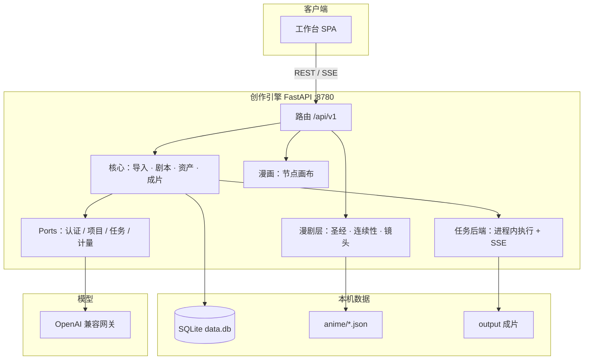

<div align="center">


# 百川Claw · 漫剧工厂

**DramaClaw 负责把故事变成视频。**  
**百川Claw 负责让故事里的角色真正连续地活在视频里。**

单机自托管的 AI 漫剧工作室：小说进、成片出；角色圣经和连续性把长篇 IP 锁住。

作者：[yanhuaichuan](https://github.com/yanhuaichuan)

[](./LICENSES/Elastic-2.0.txt)
[](./pyproject.toml)
[](./frontend/package.json)
[](https://github.com/yanhuaichuan/AnimeClaw)
[](https://gitee.com/yanhuaichuan/anime-claw)

[界面演示](#界面演示) · [技术架构](#技术架构) · [技术栈](#技术栈) · [快速开始](#快速开始) · [公众号](#公众号)

</div>

---

## 界面演示

项目管理、无限画布、资产库，是百川Claw 日常工作的三条主路径。

<p align="center">
  
</p>
<p align="center"><sub>项目管理中心：短剧项目、归档、回收站；底栏是任务中心与可收缩歌单。</sub></p>

<p align="center">
  
</p>
<p align="center"><sub>漫画画布：节点编排上传图片、音频、视频合成；任务在进程内跑，状态走 SSE。</sub></p>

<p align="center">
  
</p>
<p align="center"><sub>漫塘：角色 / 场景 / 道具 / 声线。导入小说后可从图谱自动提取角色。</sub></p>

## 这不是又一个 AIGC 视频平台

百川Claw 是基于 [DramaClaw](https://github.com/dramaclaw/dramaclaw) 的**漫剧垂直二次开发**，不是从零再造生成平台。

DramaClaw 核心已经打通：

```text
小说 → 故事解析 → 角色 → 分集 → 剧本 → 分镜 → 图片 → 声音 → 视频
```

百川Claw 只做增量，**不重写核心库、任务中心、模型网关**：

```text
动漫世界 + 角色圣经 + 角色状态 + 画面连续性
+ 漫画镜头语言 + 演技引擎 + 风格锁 + 长篇 IP 记忆
```

产品目标：

> **一个人能连续生产几十集、几百集风格统一的 AI 漫剧。**

衡量标准不是「生成一张动漫图」，而是：

> **第 1 集的白发、红眼、黑裙、左手红绳，到第 37 集必须还是同一个人。**

适合：把网文 / 短篇做成连续漫剧的创作者、要跨集不崩角的小团队、单机自托管且自带模型 key 的开发者。  
不适合：把本仓直接做成对外 SaaS（见 [许可](#许可)）。多租户、计费、团队协作不在本仓。

## 产品地图

内部路由键仍沿用 DramaClaw（如 `xiaji`），界面文案是漫剧词表。

| 界面 | 做什么 | 怎么打开 |
| --- | --- | --- |
| **漫剧** | 角色圣经、分镜、连续性、Animatic、导出 | 漫集菜单 → 漫剧，`/projects/$project/anime` |
| **漫画** | 无限画布：节点编排图 / 视频 / 音频 | 顶栏「漫画」 |
| **漫料** | 导入小说、解析章节 | 漫集 → 漫料 |
| **漫塘** | 角色、场景、道具、声线 | 漫集 → 漫塘 |
| **漫镜** | 分集剧本、草图、配音、视频、合成 | 漫集 → 漫镜 |
| **漫格** | 项目风格模板与参考图 | 漫集 → 漫格 |
| **漫条** | 任务中心：进度、续跑、取消 | 底栏任务状态 |
| **漫导** | 对话式创作助手（按产品开关） | 漫集 → 漫导 |
| **漫驿** | 模型渠道 / 工作流路由 | 设置 → 模型配置 |

项目名可用中文（汉字、字母、数字、下划线，最长 64）。工作台支持深色 / 白色外观，以及可收缩的氛围歌单（本地音频、直链、M3U / JSON，不自动播放）。

## 技术架构

社区版是**单机创作引擎**：浏览器只谈 Web，FastAPI 承载全部能力，任务在进程内执行，数据落本机，模型走一个 OpenAI 兼容网关。不需要 PostgreSQL / Redis。

```text
浏览器  :8080（Docker）或 :5173（开发）
    │  REST + SSE + Cookie
    ▼
FastAPI :8780
    ├─ DramaClaw 核心     故事 / 资产 / 分集 / 任务
    ├─ Anime 层           角色圣经 / 连续性 / 漫画镜头
    ├─ 漫画画布           节点图、生成、写回主线
    └─ Ports 适配器       认证、任务、计量（CE 给单机实现）
         │
         ├─ 本地 SQLite     state/<用户>/<项目>/data.db
         ├─ 漫剧 JSON       state/<用户>/<项目>/anime/*.json
         ├─ 成片目录        output/<用户>/<项目>/
         └─ 模型网关        官方渠道 或 本地 NewAPI
```



三条硬规则：

1. **复用 / 扩展 / 适配**，禁止重写 Core。
2. **AI 负责理解、规划、建议、生成**；规则引擎负责状态、一致性和校验。
3. **状态可追踪**：角色状态、场景状态、分集状态、剧情线索都必须落盘。

| 层 | 代码位置 | 职责 |
| --- | --- | --- |
| 工作台 | `frontend/` | 项目管理、漫画画布、漫塘、漫镜、漫剧工作室 |
| HTTP | `src/novelvideo/api/` | REST、SSE 任务流、`/api/v1/anime` |
| 漫剧域 | `src/novelvideo/anime/` | 圣经、镜头、连续性、导出；只写 `anime/` JSON |
| 核心流水线 | `agents` / `generators` / `export` | 小说解析、分镜、图声音视频、成片 |
| 任务 | `task_backend/` | CE：进程内线程 + EventSource；可取消、可续跑 |
| 边界 | `ports/` | 认证、项目、任务、计量的接口；CE 给本地实现 |

更细的端口表见 [架构说明](docs/zh/concepts/architecture.md)。

## 技术栈

| 层 | 选型 | 说明 |
| --- | --- | --- |
| 语言 | Python 3.11–3.12、TypeScript 5.8 | 后端 3.13 未支持；前端 strict |
| 后端 | FastAPI + Uvicorn + Pydantic 2 | 单进程承载创作 API |
| 智能体 | pydantic-ai 1.x、OpenAI SDK | 文本规划走网关，不绑死某一家模型 |
| 图谱 | cognee | 小说 → 角色 / 关系 / 时间线 |
| 存储 | SQLite（aiosqlite）+ JSON 文件 | 核心库一张 `data.db`；漫剧层文件存储 |
| 任务 | 进程内 runner + SSE | CE 不用 Celery / Redis |
| 媒体 | 系统 ffmpeg / ffprobe | Docker 镜像已带；本地需自装 |
| 前端 | React 19 + Vite 6 + pnpm | SPA，开发时代理到 `:8780` |
| 路由 / 数据 | TanStack Router、TanStack Query、ky | 文件路由、服务端状态、SSE 失效 |
| 客户端状态 | Zustand | 登录标记、导航、歌单等 |
| UI | Tailwind CSS 4、shadcn、Lucide | 规范见 [DESIGN.md](DESIGN.md) |
| 画布 | XYFlow、Konva | 漫画节点图与绘制 |
| 国际化 | i18next（中 / 英） | 界面默认中文 |
| 测试 | pytest、Vitest、MSW | 默认跑不含 `ee` / `e2e` |
| 部署 | Docker Compose | `api` `:8780` + `web` `:8080` |

模型（文本 / 图 / 视频 / 音频）一律经 **OpenAI 兼容网关**。网页「设置 → 模型配置」填官方 DC key，或起 `docker-compose.selfhosted.yml` 用本地 NewAPI。密钥进 `settings.db`，不要写进 Git。

## 漫剧层

进入项目后打开 **漫剧** 工作台。数据全部写在 `{state_dir}/anime/`，不动核心数据库。

1. 写入世界观 / 角色圣经 / 风格锁  
2. 一键种子 **同一角色连续 10 镜 Demo**（苏璃：正面 → 侧面 → 跑步 → 战斗 → 受伤 → 哭泣 → 夜景 → 近景 → 全身 → 回头）  
3. Shot Editor 改表情、姿势、镜头，锁定角色 / 服装 / 场景 / 风格  
4. 连续性检查 + 分层 Prompt  
5. Animatic 预览（分镜 + 对白 + 时长）  
6. 导出本集 JSON 资产包  

| 模块 | 职责 |
| --- | --- |
| `character_bible` | 外貌、服装、标志物，身份不得漂移 |
| `character_state` | 单集伤口、情绪、持有道具 |
| `scene_bible` / `style_bible` | 场景与画风锁 |
| `story_memory` / `plot_threads` | 长篇 IP 与线索 |
| `camera_engine` | 漫画镜头语言 |
| `expression_engine` / `pose_engine` / `acting_engine` | 表情、姿势、演技 |
| `continuity_engine` / `anime_qa` | 跨镜一致性与质检 |
| `anime_prompt_builder` | 分层 Prompt |
| `anime_director` / `anime_pipeline` | 导戏、10 镜 Demo、导出 |

REST 前缀：`/api/v1/anime`。常用：

```text
GET|PUT  /projects/{project}/world
GET|PUT  /projects/{project}/characters/{character}/bible
POST     /projects/{project}/episodes/{episode}/continuity/check
GET      /projects/{project}/episodes/{episode}/preview
POST     /projects/{project}/episodes/{episode}/export
POST     /projects/{project}/demo/ten-shots
```

核心流水线仍负责：导入小说、分集剧本、资产三视图、逐镜视频、TTS、字幕合成 MP4。

## 快速开始

### 前置

- **Docker**（试用 / 自托管，推荐），或 **Python 3.11–3.12** + [uv](https://docs.astral.sh/uv/) + Node 20+ + [pnpm](https://pnpm.io/)
- **ffmpeg / ffprobe**（镜像已带；本地开发见 [ffmpeg 指南](docs/zh/guides/ffmpeg.md)）
- 模型：官方网关 DC key，或 CE 自带的本地 NewAPI

### Docker

```bash
git clone https://github.com/yanhuaichuan/AnimeClaw.git
# 国内镜像：git clone https://gitee.com/yanhuaichuan/anime-claw.git
cd AnimeClaw

cp .env.example .env
# 把 PROMPT_EXPORT_PASSWORD 改成非默认值。模型 key 在网页里填。

docker compose up -d --build
docker compose ps    # api、web 均应 running
```

打开 **http://localhost:8080** → 设置 → **模型配置 → 官方渠道**，粘贴 DC key 并保存。CE 默认免登录、单本地用户。浏览器只访问 `web`，由它反代到 `api`（`:8780`）。

自带上游时：

```bash
docker compose -f docker-compose.selfhosted.yml up -d --build
```

再在「本地 NewAPI」配渠道。详见 [配置模型供应商](docs/zh/getting-started/configuring-models.md)。

### 本地开发

```bash
cp .env.example .env
uv sync --group dev
uv run novelvideo api --port 8780

cd frontend && pnpm install && pnpm dev
# Vite 默认 :5173，把 /api/v1 与 /static 代理到 :8780
```

进入项目 → 顶栏 **漫剧** 或 **漫画**。

```bash
uv run pytest                         # 后端
uv run pytest tests/test_api_anime.py # 漫剧 API
cd frontend && pnpm test              # 前端
pre-commit run --all-files            # 含密钥扫描
```

不要提交 `.env`、provider key、签名 URL、`frontend/state/` 本地库。

## 仓库结构

```text
src/novelvideo/     创作引擎
  api/              REST / SSE（含 /api/v1/anime）
  anime/            角色圣经、连续性、漫画镜头
  task_backend/     任务执行
  generators/       图 / 视频 / 音频适配
  freezone/         无限画布后端
  chat/             漫导
  ports/            端口与 CE 适配器
frontend/           React 工作台
tests/              pytest
docs/zh             中文安装 / 模型 / 自托管 / 排错
docs/assets         本页演示截图与公众号二维码
DESIGN.md           视觉规范（对齐 frontend/src/index.css）
```

| 文档 | 内容 |
| --- | --- |
| [快速开始](docs/zh/getting-started/quickstart.md) | Docker 跑起来 |
| [安装指南](docs/zh/getting-started/installation.md) | macOS / Windows / Linux |
| [配置模型](docs/zh/getting-started/configuring-models.md) | 官方渠道 / 本地 NewAPI |
| [功能总览](docs/zh/concepts/features.md) | 流水线能力 |
| [架构](docs/zh/concepts/architecture.md) | 系统怎么运作 |
| [自托管](docs/zh/guides/self-hosting.md) | 部署 / 升级 / 备份 |
| [排错](docs/zh/guides/troubleshooting.md) | 常见故障 |
| [环境变量](docs/zh/reference/environment-variables.md) | 配置速查 |
| [贡献指南](CONTRIBUTING.md) | PR 与 DCO |

## 公众号

扫码关注作者公众号，看更新说明与使用笔记。

<p align="center">
  
</p>

仓库：

- GitHub：https://github.com/yanhuaichuan/AnimeClaw
- Gitee：https://gitee.com/yanhuaichuan/anime-claw

## 许可

[Elastic License 2.0](./LICENSES/Elastic-2.0.txt)，**源码可得（source available）**，不是 OSI 定义的开源。通俗说明见 [许可证](docs/zh/license.md)。

- 可以：本地 / 自托管、修改二次开发、用它给客户交付作品  
- 不可以：把本软件作为托管服务提供给第三方（做成 SaaS 转售）

百川Claw 域代码作者 **yanhuaichuan**。DramaClaw 商标与品牌资产仍归原权利人。

---

English overview: 百川Claw is a manga-drama layer on DramaClaw Core (Character Bible, shot continuity, manga camera). Run with Docker at `http://localhost:8080`. Full English guides: [docs/en](docs/en/README.md).
